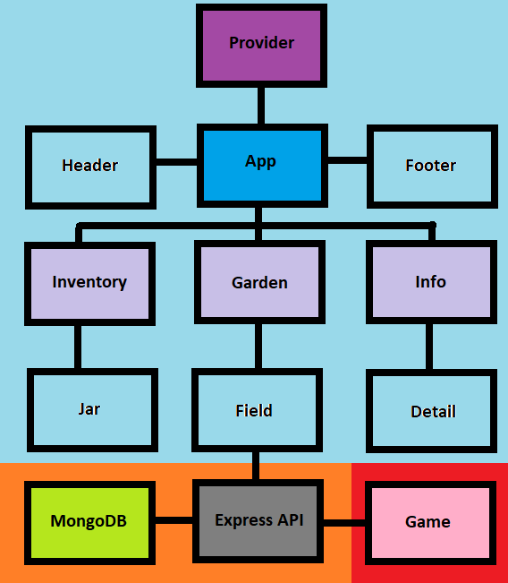

# **WurzelBot** (MongoDB, Express, React, Node.js)

React bot for Wurzel Empire farming game. For more information head to:
[WurzelBot v2](https://github.com/Eghizio/WurzelBot)

**_This project is WORK IN PROGRESS(further referred as "WIP") so certain things might undergo changes on the go._**

## **Front-End:** React (Context API)
Front-end user interface mimicking game UI. The interface allows to monitor the state of the fields,crops and inventory. 
The main **_Components_** are:
* **_Header_**
* **_Inventory_**
* **_Garden_**
* **_Info_**
* **_Footer_**

Where **_Header_** and **_Footer_** are just presentational **_Components_**, which might be extended with **Menu**/**Login**(if it will be deployed for public use), and **Contact**.

The **_core Components_** are **_Inventory_**,**_Garden_** and **_Info_**. Those Components exchange its state witch each other via **_Context API_**. 

**_Inventory_** Component is a _container_ for **_Jars_** Components as well as the **_Garden_** Component is a _container_ for **_Fields_** Components. The _containers_ are the source of **_Context API_** allowing to access the _context_(store) for children Components. Same as the **_Inventory_** and **_Garden_** the **_Info_** Component is also a _container_ and a source of _context_ for **_Details_** Component which is _conditionaly rendered_ based on the selected(clicked) item/field.

**_TL;DR Inventory,Garden & Info provide context for their children Jars,Fields & Details, where Details are conditionaly rendered based on the selected item/field._**

The basic layout and UI is already implemented. Although it's still **WIP** and the styling is temporary(I like to finish the looks when the full functionality is implemented) because most of the content is dependable on the data comming from the **_Back-End_** which is not implemented yet(just started setting up the server and routing)

## **Back-End:** Node.js, Express.js, MongoDB

The Back-End (**_WIP_**) is build upon _Node.js_ using _Express.js_ which will be handling the requests to the game based on the _API_ calls from Front-End interface. The **_Fields_** will hold the state of themselves based on the game request status responses. The calls to _Express API_ will be comming from **_Info_**.
The state of **_Fields_** will be persistent thanks to the _MongoDB_ so the application doesn't need to run all the time. The bot will schedule harvesting and re-watering the crops. Auto login feature is complete(session 2h, maintenance around 3-5 AM)

